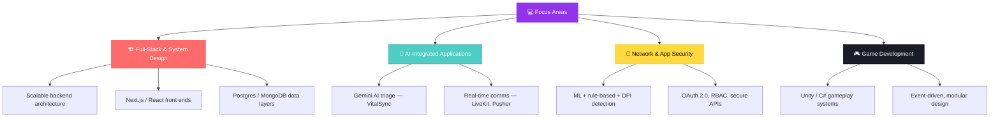

<div align="center">


# 👨‍💻 Gaurav Tiwari

**Full-Stack Developer & Problem Solver** | Electronics Engineering @ RGIPT · CS Minor @ IIT Mandi

<a href="https://github.com/Gauravtiwari31">
  
</a>

[](mailto:gauravt9431@gmail.com)
[](https://www.linkedin.com/in/gaurav-tiwari-66012831b/)
[](https://portfolio-c5yw.vercel.app/)
[](https://github.com/Gauravtiwari31)
[](https://www.instagram.com/gau.ravtiwari01/)
[](https://www.youtube.com/@Tiwari_00-t7m)

</div>

---

<div align="center">

### 🧭 Quick Navigation

[📊 Stats](#-github-stats) · [👋 About](#-about-me) · [🛠️ Tech Stack](#️-tech-stack) · [🚀 Featured Projects](#-featured-projects) · [🗂️ More Projects](#️-more-projects) · [💼 Experience](#-professional-experience) · [🎓 Education & Leadership](#-education--leadership) · [🗺️ Roadmap](#️-currently-exploring) · [🤝 Connect](#-lets-connect)

</div>

---

<div align="center">

</div>

## 📊 GitHub Stats

<div align="center">


<br>


<br>


</div>

> 📌 22 public repositories · 8 followers · "Pair Extraordinaire" achievement · [`Online-Commerce_MERN-Stack`](https://github.com/Gauravtiwari31/Online-Commerce_MERN-Stack) is the most-starred repo.

---

<div align="center">

</div>

## 👋 About Me

```typescript
const gaurav: Developer = {
  name:     "Gaurav Tiwari",
  role:     "Full-Stack Developer & Electronics Engineering Undergrad",
  location: "🇮🇳 India",

  education: {
    degree: "B.Tech, Electronics Engineering — RGIPT, Amethi (2024–2028)",
    minor:  "CS Engineering — IIT Mandi (Aug 2025 – May 2026)",
  },

  focus: [
    "🏗️  Backend-first full-stack applications",
    "🧩  Designing scalable, production-quality system architecture",
    "🤖  Wiring AI services (Gemini, ML pipelines) into real products",
    "🔐  RBAC, OAuth 2.0, and secure API design",
  ],

  stack: {
    languages: ["C++", "C#", "Python", "JavaScript", "TypeScript", "SQL"],
    frontend:  ["React", "Next.js", "Vue.js", "Tailwind CSS"],
    backend:   ["Node.js", "Express.js", "Django", "Flask"],
    database:  ["PostgreSQL", "MongoDB", "Firebase"],
    devOps:    ["Docker", "Vercel", "Netlify", "Git/GitHub"],
    aiMl:      ["NumPy", "Scikit-learn", "OpenCV", "Streamlit"],
  },

  currentRoles: [
    "Co-Head, IEEE Student Branch @ RGIPT",
  ],

  principle: "If I can't explain why a piece of code works, I don't trust it.",
};
```

---

<div align="center">

</div>

## 🛠️ Tech Stack

<div align="center">

<a href="https://skillicons.dev">
  
</a>

<br><br>

**Languages**


**Frontend & UI/UX**


**Backend & Databases**


**DevOps, Tools & Cloud**


**AI, ML & Security**


</div>

---

<div align="center">

</div>

## 🚀 Featured Projects

| Project | Description | Tech | Live Demo | Source |
|---|---|---|---|---|
| 🏥 **VitalSync** | Multi-role healthcare platform with dashboards for appointment scheduling, OPD queue management, and room allocation. Integrates Gemini AI (triage), LiveKit (WebRTC), Pusher (real-time), and Razorpay (payments); secured with OAuth 2.0, Prisma ORM, and RBAC. |    | [Visit](https://vitalsync-six-sand.vercel.app) | [Repo](https://github.com/Gauravtiwari31/VitalSync) |
| 🛡️ **AI-Powered Network Security Framework** | Real-time network packet inspection and malicious-traffic detection using a 3-layer hybrid pipeline (ML, rule-based, DPI). Reduces false negatives via blacklist IP filtering and regex payload inspection, flagging SQL injections and 15+ suspicious traffic patterns. |   | — | [Repo](https://github.com/Gauravtiwari31/AI-Powered-Network-Security-Framework) |
| 🛒 **Online Commerce Platform** | MERN-stack e-commerce app with full order-lifecycle management, JWT auth, and RBAC, containerized via Docker. Content-based recommendation engine, APIs documented with Swagger/OpenAPI. ⭐ Most-starred repo on the profile. |     | — | [Repo](https://github.com/Gauravtiwari31/Online-Commerce_MERN-Stack) |

<div align="center">

<a href="https://github.com/Gauravtiwari31/VitalSync">
  
</a>
<a href="https://github.com/Gauravtiwari31/Online-Commerce_MERN-Stack">
  
</a>

</div>

---

<div align="center">

</div>

## 🗂️ More Projects

| Project | Description | Tech | Live Demo | Source |
|---|---|---|---|---|
| 🌐 **Portfolio** | Personal developer portfolio site. |  | [Visit](https://portfolio-c5yw.vercel.app) | [Repo](https://github.com/Gauravtiwari31/Portfolio) |
| 🎨 **Portfolio-Maker** | Tool/template for generating personal portfolio sites. |  | [Visit](https://gauravtiwari31.github.io/Portfolio-Maker) | [Repo](https://github.com/Gauravtiwari31/Portfolio-Maker) |
| 🛰️ **MeraCodeLikhDo — ISRO BAH 2026** | Submission for the ISRO Bharatiya Antariksh Hackathon 2026. |  | [Visit](https://mera-code-likh-do-isro-bah.vercel.app) | [Repo](https://github.com/Gauravtiwari31/MeraCodeLikhDo_Isro_BAH_2026) |
| 🏥 **HAQMS** *(fork)* | Hospital/queue-management system, forked for study and extension. | — | [Visit](https://haqms-navy.vercel.app) | [Repo](https://github.com/Gauravtiwari31/HAQMS) |
| 🔁 **BiztelAI Workflow System** | AI-driven workflow automation system. |  | — | [Repo](https://github.com/Gauravtiwari31/BiztelAI-Workflowsystem-AI) |
| 🌱 **Ecoyaan Checkout** | Checkout flow module for the Ecoyaan platform. |  | — | [Repo](https://github.com/Gauravtiwari31/ecoyaan-checkout) |
| 📍 **Geofencing (SachetYatri)** | Location-based geofencing web app. |  | [Visit](https://sachetyatri-mfr4.vercel.app) | [Repo](https://github.com/Gauravtiwari31/geofencing) |
| ❌⭕ **Tic-Tac-Toe AI** | Tic-tac-toe with an AI opponent. |  | [Visit](https://tic-tac-toeai.vercel.app) | [Repo](https://github.com/Gauravtiwari31/Project-Rollout-B3M1-Tic-Tac-Toe) |
| ⚙️ **Yantr** | Web app project. |  | [Visit](https://yantr.vercel.app) | [Repo](https://github.com/Gauravtiwari31/Yantr) |
| 💰 **Expense Tracker** | Personal expense-tracking tool. |  | — | [Repo](https://github.com/Gauravtiwari31/Expense-Tracker) |
| 🎮 **PMX** | Web app project. |  | — | [Repo](https://github.com/Gauravtiwari31/PMX) |

<details>
<summary><b>🍴 Forked reference repos</b></summary>
<br>

> Kept for study/reference rather than original work.

- [**tldr**](https://github.com/Gauravtiwari31/tldr) — fork of the community-maintained collaborative cheatsheets for console commands.

</details>

---

<div align="center">

</div>

## 💼 Professional Experience

**Technical Project Manager Intern** · *Neeyat AI*  
`March 2026 – April 2026`
- Contributed to a cloud-native MCP server for AI-driven performance testing, defining product features and technical workflows.
- Managed sprint planning and backlog prioritization, translating product requirements into actionable tasks for a cross-functional team.

**Gameplay Programmer Intern** · *Aurelio Game Studio*  
`May 2026 – June 2026`
- Developed gameplay mechanics in Unity (C#), implementing event-driven logic with modular, reusable code structures.
- Optimized runtime stability by profiling scripts and resolving performance bottlenecks across multiple scenarios.

---

<div align="center">

</div>

## 🎓 Education & Leadership

- 🏫 **B.Tech, Electronics Engineering** — RGIPT, Amethi *(2024 – 2028)*
- 📘 **Minor, Computer Science Engineering** — IIT Mandi *(Aug 2025 – May 2026)*
- 🧑‍💼 **Co-Head, IEEE Student Branch, RGIPT** *(Nov 2025 – Present)* — led a team of 8 volunteers to run 3+ technical workshops reaching 150+ students.

**Achievements**


-4169E1?style=for-the-badge)

---

<div align="center">

</div>

## 🗺️ Currently Exploring



---

<div align="center">

## 🤝 Let's Connect


<br>

### 🌟 *"If I can't explain why a piece of code works, I don't trust it."*

<br>

[](mailto:gauravt9431@gmail.com)
[](https://www.linkedin.com/in/gaurav-tiwari-66012831b/)
[](https://github.com/Gauravtiwari31)

<br>


**⭐️ From [Gauravtiwari31](https://github.com/Gauravtiwari31) — Made with 💚 in Markdown**


</div>
